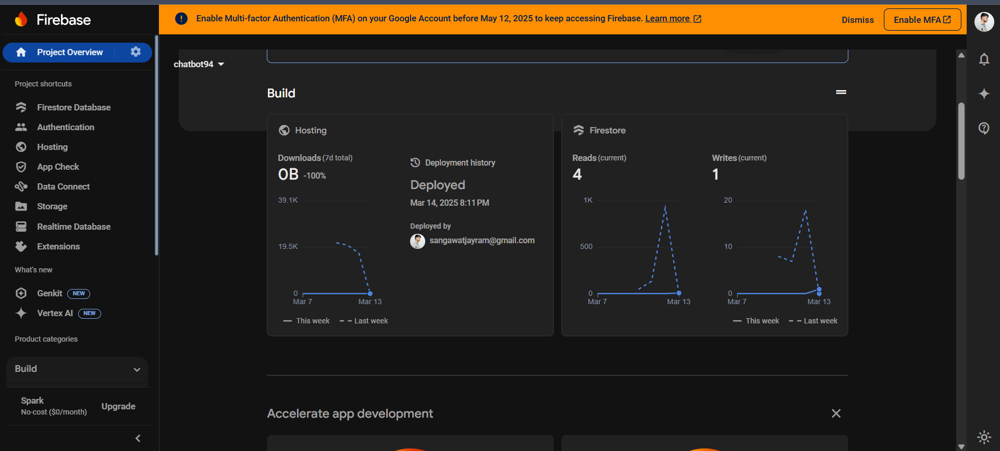
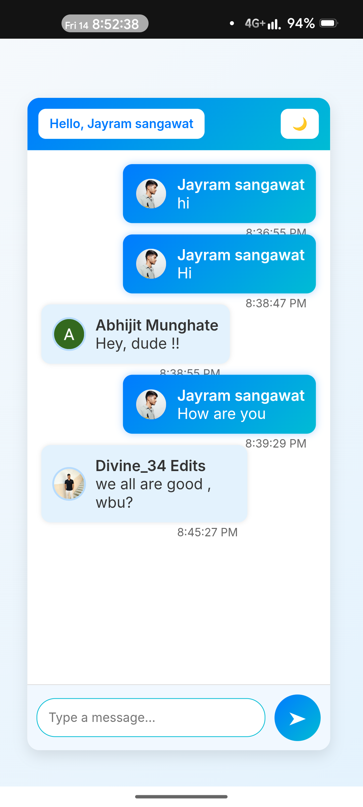

# 💬 Welcome to ChatRoom!

Hey there! 👋 Welcome to **ChatRoom**, a fun and simple real-time chat app built with **HTML, CSS, JavaScript, and Firebase**. Connect with your friends, send messages instantly, and enjoy seamless chatting!

## 🚀 What Makes ChatRoom Awesome?

✨ **Instant Messaging** – Messages appear in real-time!  
🔐 **Secure Login** – Google Sign-In for quick access.  
📜 **Message History** – Chats are saved, so you never lose them.  
🎨 **Cool & Responsive UI** – Works on any device.  
⏳ **Timestamps** – Know exactly when a message was sent.

## 🛠️ What’s Under the Hood?

ChatRoom is powered by:

🛠 **HTML, CSS, JavaScript** – The core building blocks.  
🔥 **Firebase Firestore** – Stores all your messages in real-time.  
🔐 **Firebase Authentication** – Google Sign-In for easy access.  
🚀 **Firebase Hosting** – (If deployed) for live access.

## 📂 How to Get Started

### 1️⃣ Clone This Project
```sh
git clone https://github.com/jayramgit94/ChatRoom_FireBase.git
cd ChatRoom_FireBase
```

### 2️⃣ Set Up Firebase
- Go to [Firebase Console](https://console.firebase.google.com/)
- Create a project & enable **Firestore Database** + **Google Sign-In**
- Copy your Firebase config and update `firebase-config.js`

### 3️⃣ Run ChatRoom
- Open `index.html` in a browser.
- Start chatting instantly! 🎉

## 🖼️ A Sneak Peek (Screenshots)

_Add screenshots and GIFs here!_







## 🌟 Future Cool Stuff (Coming Soon!)

🚀 **Dark Mode** for night owls.  
📷 **Send Images & Files** in chat.  
🔔 **Notifications** for new messages.  
🗨 **Private Messaging** for one-on-one chats.

## 🌍 Try It Live!

🔗 _[Live Demo](https://your-deployed-link.com)_ (If available)

## 👥 Want to Contribute?

We’d love your help! 🛠
1️⃣ **Fork this repo**  
2️⃣ **Create a new branch**  
```sh
git checkout -b feature-branch
```
3️⃣ **Make awesome changes & commit**  
```sh
git commit -m "Added an awesome feature!"
```
4️⃣ **Push & create a Pull Request!** 🎉
```sh
git push origin feature-branch
```

## 📜 License

📜 Open-source and licensed under **MIT License**. Use, modify, and share freely! 🤩

## 📧 Let’s Connect!
📩 **Email:** your-email@example.com  
🔗 **GitHub:** [jayramgit94](https://github.com/jayramgit94)

---

Hope you enjoy using ChatRoom! 🚀💬 Drop a ⭐ if you like it!

